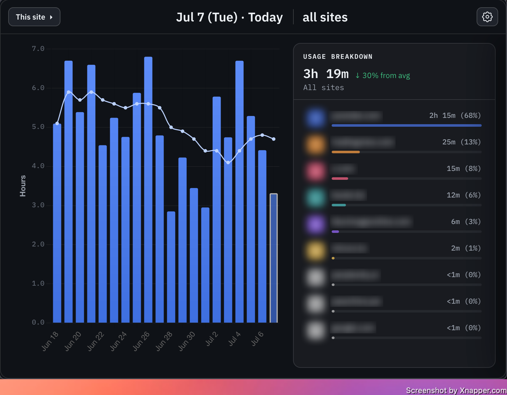
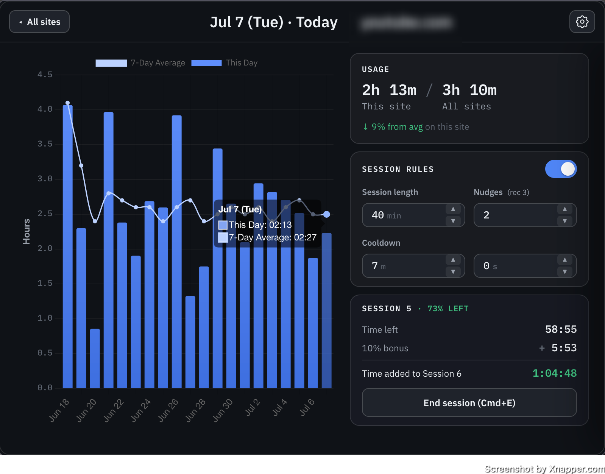

# WebTime

> Track and take control of your time.

A Firefox browser extension that tracks how long you spend on each site, with a
small timer in the corner of your screen, and gives you the tools to spend that
time mindfully. It uses **session-based browsing** that's both disciplined and
flexible — focused sessions, gentle nudges, and cooldowns when a limit is reached.

## Screenshots

| All sites | Single site |
|:---:|:---:|
|  |  |

## Install

WebTime is published on
[Firefox Add-ons (AMO)](https://addons.mozilla.org/en-US/firefox/addon/web-time/)

You can also install the latest build directly from
[GitHub Releases](https://github.com/Id3arium/WebTime/releases): download the
`.zip`/`.xpi` and load it via `about:addons` → ⚙️ → **Install Add-on From
File…**. (For development, see [Loading in Firefox](#loading-in-firefox) below.)

## Philosophy

WebTime favors **awareness, then accountability**. Most of the time it just
keeps you informed: a quick visual pulse early, an awareness popup when you're
approaching your typical usage, and a 60-second wind-down near a session's end.
Only once you've actually exceeded a session limit does a cooldown block the
page — a real pause, made flexible by carryover and the option to end a session
early on your own terms.

## Features

**Visualize your data**

- **Per-domain time tracking** with a small on-page timer (shows the current
  session by default; click to peek at today's total).
- **Usage chart** in the toolbar popup — track individual sites over time, and
  expand any day for a detailed breakdown.
- **7-day moving averages** to spot patterns, plus a popup when you cross ~80%
  of your trailing 7-day average for a domain.
- **All your data stays local** — nothing leaves your browser.

**Mindful accountability**

- **Minimalist nudges** — brief overlays that get more frequent as a session
  nears its end (sparse early, accelerating late), without interrupting your flow.
- **Session limits with cooldowns** — after continuous use past a configurable
  limit, a cooldown blocks the page; each successive cooldown grows.
- **End a session early** — unused time rolls over to your next session, plus an
  extra 10% on top, so stopping early is rewarded, not punished.
- **Wind-down mode** — a bar across the top of the page that drains down over
  the final 60 seconds of a session, a visible heads-up that time's almost up.
- **Per-site limits** — customize what works for each site. Your time, your
  decisions.

## Architecture

Three layers, deliberately separated:

| Path | Role |
|------|------|
| [`src/background.ts`](src/background.ts) | The engine: tab tracking, the 1s timer loop, storage/persistence, and all intervention dispatch. |
| [`src/content.ts`](src/content.ts) | In-page UI: the timer widget, blur overlay, nudge animation, and all popups. |
| [`src/popup/`](src/popup/) | The toolbar popup — chart building, data processing, state, and UI across several modules, bundled to `popup-bundle.js`. |
| [`src/shared/session-model.ts`](src/shared/session-model.ts) | **Pure, browser-free** session math — boundaries, carryover, nudge timing, grace, wind-down. Fully unit-tested. |
| [`src/shared/utils.ts`](src/shared/utils.ts) | Pure helpers — domain extraction, time formatting, 7-day stats. |
| [`src/shared/constants.ts`](src/shared/constants.ts) | Shared tuning constants and defaults. |
| [`src/types.ts`](src/types.ts) | Shared type definitions. |

The pure modules in `src/shared/` contain no browser APIs so they can be tested
in isolation with `node --test`.

## Development

Requires Node. All build tooling — esbuild and
[`web-ext`](https://github.com/mozilla/web-ext) — is pinned as a dev dependency,
so a fresh `npm install` is the only setup; nothing needs a global install.

```bash
npm install        # install all dev dependencies (esbuild, web-ext, tsc)
npm run typecheck  # tsc --noEmit
npm test           # run the node:test suites in test/
npm run build      # typecheck + bundle to extension/dist/ via esbuild
npm run watch      # tsc in watch mode
```

`npm run build` bundles `background.ts`, `content.ts`, and the popup into
`extension/dist/` (see [`build.mjs`](build.mjs)). Those bundled files are what
[`manifest.json`](extension/manifest.json) loads.

### Full build + package

[`build.sh`](build.sh) is the canonical "ship it" command. It runs the
typecheck, then the tests, then packages a signed-ready `.zip`/`.xpi` into
`artifacts/` with the project-local `web-ext` (`npx web-ext`), so the result is
reproducible on any clean checkout:

```bash
./build.sh
```

Because it gates on the tests, a failing suite aborts the package step.

## Loading in Firefox

1. Run `npm run build` so `extension/dist/` is populated.
2. Open `about:debugging` → **This Firefox** → **Load Temporary Add-on…**
3. Select [`extension/manifest.json`](extension/manifest.json).

The extension is Manifest V2 and targets Firefox (it uses the `browser.*`
WebExtension APIs). Temporary add-ons are removed when Firefox restarts; rebuild
and reload to pick up changes.

## Releasing

[`release.sh`](release.sh) tags a version and publishes its build to
[GitHub Releases](https://github.com/Id3arium/WebTime/releases). The version is
read from [`manifest.json`](extension/manifest.json) — the single source of
truth — so the tag and the build can never disagree.

```bash
./release.sh
```

It is deliberately strict, and will refuse to run if:

- the working tree is **dirty** (a release tag must match committed code),
- local commits are **not pushed** to `origin`,
- a release for the current version **already exists** (bump the version first).

When the checks pass it builds a fresh artifact via `build.sh` and attaches it to
a `v<version>` release, with notes auto-generated from the commits since the last
release. To cut a new release: bump `version` in `manifest.json` (and
`package.json`), commit, push, then run `./release.sh`.

## Testing

Tests live in [`test/`](test/) and run via `node --test`. Each suite bundles the
relevant `src/shared/` module with esbuild and imports the **real** source (no
copy-pasted logic), so tests can't silently drift from the implementation:

- [`test/session-model.test.mjs`](test/session-model.test.mjs) — boundaries,
  carryover, end-early, cooldowns, nudges, grace, wind-down.
- [`test/seven-day-stats.test.mjs`](test/seven-day-stats.test.mjs) — 7-day
  average stats that drive the average popup.

```bash
npm test
```
